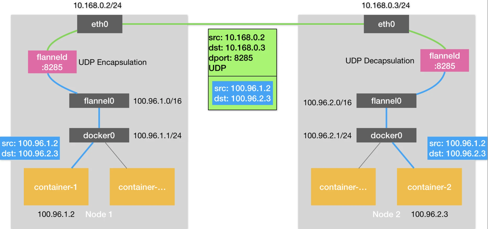
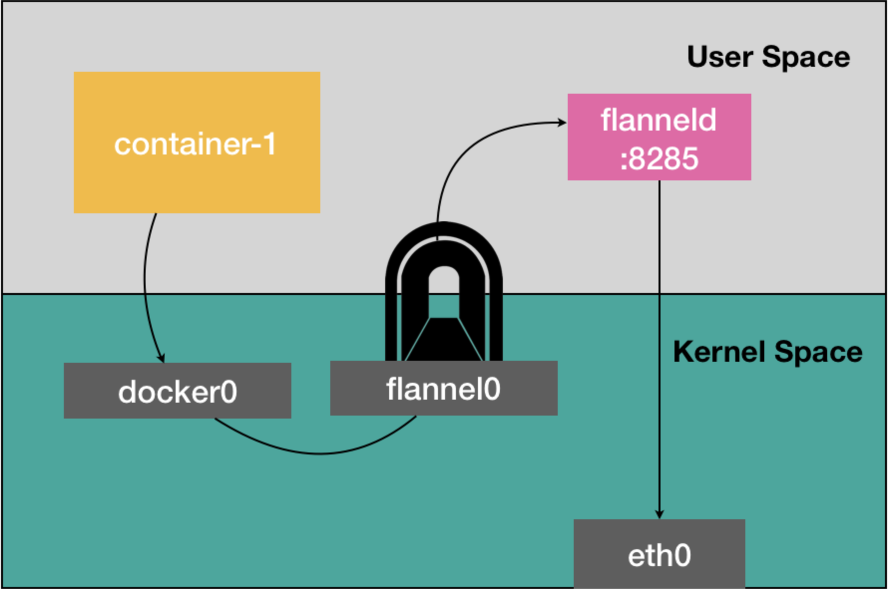

## 网络笔记:

要理解容器“跨主通信”的原理,就一定要先从 Flannel 这个项目说起.
Flannel 项目是 CoreOS 公司主推的容器网络方案。事实上，Flannel 项目本身只是一个框架，真正为我们提供容器网络功能的，是 Flannel 的后端实现。目前，Flannel 支持三种后端实现，分别是：
1. VXLAN
2. host-gw
3. UDP

这三种不同的后端实现，正代表了三种容器跨主网络的主流实现方法. 所以，在今天这篇文章中，我会先从 UDP 模式开始，来为你讲解容器“跨主网络”的实现原理。

在这个例子中，我有两台宿主机。
- 宿主机 Node 1 上有一个容器 container-1，它的 IP 地址是 100.96.1.2，对应的 docker0 网桥的地址是：100.96.1.1/24。
- 宿主机 Node 2 上有一个容器 container-2，它的 IP 地址是 100.96.2.3，对应的 docker0 网桥的地址是：100.96.2.1/24。

我们现在的任务，就是让 container-1 访问 container-2

这种情况下，container-1 容器里的进程发起的 IP 包，其源地址就是 100.96.1.2，目的地址就是 100.96.2.3。由于目的地址 100.96.2.3 并不在 Node 1 的 docker0 网桥的网段里，所以这个 IP 包会被交给默认路由规则，通过容器的网关进入 docker0 网桥（如果是同一台宿主机上的容器间通信，走的是直连规则），从而出现在宿主机上.

这时候，这个 IP 包的下一个目的地，就取决于宿主机上的路由规则了。此时，Flannel 已经在宿主机上创建出了一系列的路由规则，以 Node 1 为例，如下所示：
```
# 在Node 1上
$ ip route
default via 10.168.0.1 dev eth0
100.96.0.0/16 dev flannel0  proto kernel  scope link  src 100.96.1.0
100.96.1.0/24 dev docker0  proto kernel  scope link  src 100.96.1.1
10.168.0.0/24 dev eth0  proto kernel  scope link  src 10.168.0.2
```
可以看到，由于我们的 IP 包的目的地址是 100.96.2.3，它匹配不到本机 docker0 网桥对应的 100.96.1.0/24 网段，只能匹配到第二条、也就是 100.96.0.0/16 对应的这条路由规则，从而进入到一个叫作 flannel0 的设备中。

而这个 flannel0 设备的类型就比较有意思了：它是一个 TUN 设备（Tunnel 设备）。

在 Linux 中，TUN 设备是一种工作在三层（Network Layer）的虚拟网络设备。TUN 设备的功能非常简单，即：在操作系统内核和用户应用程序之间传递 IP 包。

以 flannel0 设备为例：像上面提到的情况，当操作系统将一个 IP 包发送给 flannel0 设备之后，flannel0 就会把这个 IP 包，交给创建这个设备的应用程序，也就是 Flannel 进程。这是一个从内核态（Linux 操作系统）向用户态（Flannel 进程）的流动方向。

反之，如果 Flannel 进程向 flannel0 设备发送了一个 IP 包，那么这个 IP 包就会出现在宿主机网络栈中，然后根据宿主机的路由表进行下一步处理。这是一个从用户态向内核态的流动方向。

所以，当 IP 包从容器经过 docker0 出现在宿主机，然后又根据路由表进入 flannel0 设备后，宿主机上的 flanneld 进程（Flannel 项目在每个宿主机上的主进程），就会收到这个 IP 包。然后，flanneld 看到了这个 IP 包的目的地址，是 100.96.2.3，就把它发送给了 Node 2 宿主机。

等一下，flanneld 又是如何知道这个 IP 地址对应的容器，是运行在 Node 2 上的呢？

这里，就用到了 Flannel 项目里一个非常重要的概念：子网（Subnet）。

事实上，在由 Flannel 管理的容器网络里，一台宿主机上的所有容器，都属于该宿主机被分配的一个“子网”。在我们的例子中，Node 1 的子网是 100.96.1.0/24，container-1 的 IP 地址是 100.96.1.2。Node 2 的子网是 100.96.2.0/24，container-2 的 IP 地址是 100.96.2.3。

而这些子网与宿主机的对应关系，正是保存在 Etcd 当中，如下所示：
```
$ etcdctl ls /coreos.com/network/subnets
/coreos.com/network/subnets/100.96.1.0-24
/coreos.com/network/subnets/100.96.2.0-24
/coreos.com/network/subnets/100.96.3.0-24
```
所以，flanneld 进程在处理由 flannel0 传入的 IP 包时，就可以根据目的 IP 的地址（比如 100.96.2.3），匹配到对应的子网（比如 100.96.2.0/24），从 Etcd 中找到这个子网对应的宿主机的 IP 地址是 10.168.0.3，如下所示：
```
$ etcdctl get /coreos.com/network/subnets/100.96.2.0-24
{"PublicIP":"10.168.0.3"}
```
而对于 flanneld 来说，只要 Node 1 和 Node 2 是互通的，那么 flanneld 作为 Node 1 上的一个普通进程，就一定可以通过上述 IP 地址（10.168.0.3）访问到 Node 2，这没有任何问题。

所以说，flanneld 在收到 container-1 发给 container-2 的 IP 包之后，就会把这个 IP 包直接封装在一个 UDP 包里，然后发送给 Node 2。不难理解，这个 UDP 包的源地址，就是 flanneld 所在的 Node 1 的地址，而目的地址，则是 container-2 所在的宿主机 Node 2 的地址。

当然，这个请求得以完成的原因是，每台宿主机上的 flanneld，都监听着一个 8285 端口，所以 flanneld 只要把 UDP 包发往 Node 2 的 8285 端口即可。

通过这样一个普通的、宿主机之间的 UDP 通信，一个 UDP 包就从 Node 1 到达了 Node 2。而 Node 2 上监听 8285 端口的进程也是 flanneld，所以这时候，flanneld 就可以从这个 UDP 包里解析出封装在里面的、container-1 发来的原 IP 包。

而接下来 flanneld 的工作就非常简单了：flanneld 会直接把这个 IP 包发送给它所管理的 TUN 设备，即 flannel0 设备。

根据我前面讲解的 TUN 设备的原理，这正是一个从用户态向内核态的流动方向（Flannel 进程向 TUN 设备发送数据包），所以 Linux 内核网络栈就会负责处理这个 IP 包，具体的处理方法，就是通过本机的路由表来寻找这个 IP 包的下一步流向。

而 Node 2 上的路由表，跟 Node 1 非常类似，如下所示：
```
# 在Node 2上
$ ip route
default via 10.168.0.1 dev eth0
100.96.0.0/16 dev flannel0  proto kernel  scope link  src 100.96.2.0
100.96.2.0/24 dev docker0  proto kernel  scope link  src 100.96.2.1
10.168.0.0/24 dev eth0  proto kernel  scope link  src 10.168.0.3
```
由于这个 IP 包的目的地址是 100.96.2.3，它跟第三条、也就是 100.96.2.0/24 网段对应的路由规则匹配更加精确。所以，Linux 内核就会按照这条路由规则，把这个 IP 包转发给 docker0 网桥。

接下来的流程，就如同我在上一篇文章《浅谈容器网络》中和你分享的那样，docker0 网桥会扮演二层交换机的角色，将数据包发送给正确的端口，进而通过 Veth Pair 设备进入到 container-2 的 Network Namespace 里。

而 container-2 返回给 container-1 的数据包，则会经过与上述过程完全相反的路径回到 container-1 中。

需要注意的是，上述流程要正确工作还有一个重要的前提，那就是 docker0 网桥的地址范围必须是 Flannel 为宿主机分配的子网。这个很容易实现，以 Node 1 为例，你只需要给它上面的 Docker Daemon 启动时配置如下所示的 bip 参数即可：
```
$ FLANNEL_SUBNET=100.96.1.1/24
$ dockerd --bip=$FLANNEL_SUBNET ...
```
以上，就是基于 Flannel UDP 模式的跨主通信的基本原理了。我把它总结成了一幅原理图，如下所示。

基于UDP的跨主机通信基本原理: 


可以看到，Flannel UDP 模式提供的其实是一个三层的 Overlay 网络，即：它首先对发出端的 IP 包进行 UDP 封装，然后在接收端进行解封装拿到原始的 IP 包，进而把这个 IP 包转发给目标容器。这就好比，Flannel 在不同宿主机上的两个容器之间打通了一条“隧道”，使得这两个容器可以直接使用 IP 地址进行通信，而无需关心容器和宿主机的分布情况。

我前面曾经提到，上述 UDP 模式有严重的性能问题，所以已经被废弃了。通过我上面的讲述，你有没有发现性能问题出现在了哪里呢？

实际上，相比于两台宿主机之间的直接通信，基于 Flannel UDP 模式的容器通信多了一个额外的步骤，即 flanneld 的处理过程。而这个过程，由于使用到了 flannel0 这个 TUN 设备，仅在发出 IP 包的过程中，就需要经过三次用户态与内核态之间的数据拷贝，如下所示：

TUN设备示意图:


我们可以看到：

第一次，用户态的容器进程发出的 IP 包经过 docker0 网桥进入内核态；

第二次，IP 包根据路由表进入 TUN（flannel0）设备，从而回到用户态的 flanneld 进程；

第三次，flanneld 进行 UDP 封包之后重新进入内核态，将 UDP 包通过宿主机的 eth0 发出去。

此外，我们还可以看到，Flannel 进行 UDP 封装（Encapsulation）和解封装（Decapsulation）的过程，也都是在用户态完成的。在 Linux 操作系统中，上述这些上下文切换和用户态操作的代价其实是比较高的，这也正是造成 Flannel UDP 模式性能不好的主要原因。

所以说，我们在进行系统级编程的时候，有一个非常重要的优化原则，就是要减少用户态到内核态的切换次数，并且把核心的处理逻辑都放在内核态进行。这也是为什么，Flannel 后来支持的VXLAN 模式，逐渐成为了主流的容器网络方案的原因。