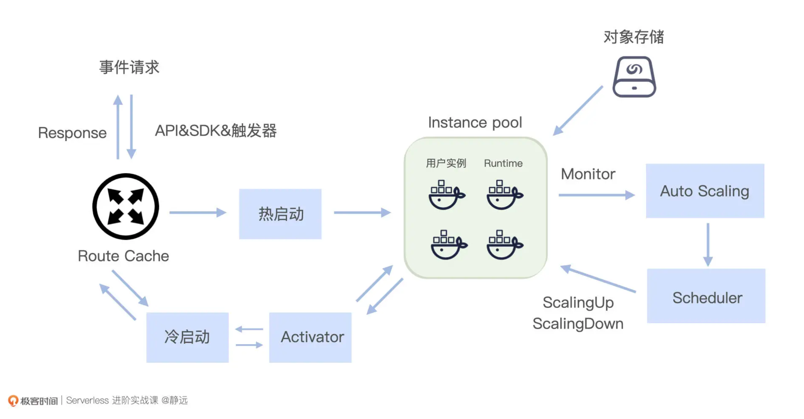

## 基本概念
Serverless 是一种架构设计的理念,它不是一个具体的编程框架、类库或者工具。Serverless 是 FaaS 和 BaaS 的组合，这个简单明了的定义，奠定了 Serverless 组成结构的基础。

Serverless Computing 是构建和运行不需要服务器管理的应用程序。它描述了一种更细粒度的部署模型，将一个或多个功能的应用程序打包上传到 Serverless 平台，然后根据实际的需求，执行、扩展和计费。

Serverless 是能够实现业务和基础设施分离，提升用户业务创新能力的理念。

## Serverless优势
Serverless优势体现在以下三点
1. 快速的开发交付
2. 极高的运维效率
3. 极低的资源成本

## Serverless应用场景
- 函数计算（FaaS）：面向函数，用户只需关注函数层级的代码，用于解决轻量型、无状态、有时效的任务
- Serverless 应用托管：面向应用，用户只需要更关注应用本身，与微服务结合，它融合应用治理、可观测，降低了新应用的构建成本、老应用的适配改造成本
- Serverelss 容器服务：面向容器，在不改变当前 Kubernetes 的前提下，由于不再需要关注节点，大大提升了前期资源的准备过程，降低了维护成本，使得应用的全生命周期管理更高效

## Faas共工作流程
